# Spotify Key Analyzer

## Inspiration
As a keen musician, I thought to make this project to help my fellow musicians, for finding the key of the songs and the tempo for their practice. The beginners might get lost at the start. Please keep in mind, machine can be wrong in many instances, so trust your musical skills, your listening abilities and your gut to follow your profession. Don't depend on these applications fully :)

## Table of Contents
- [Overview](#overview)
- [Features](#features)
- [Project Structure](#project-structure)
- [Algorithm Flowchart](#algorithm-flowchart)
- [Installation](#installation)
- [Usage](#usage)
- [Technical Details](#technical-details)
- [Key Detection Algorithm](#key-detection-algorithm)
- [API Reference](#api-reference)
- [Troubleshooting](#troubleshooting)
- [License](#license)

## Overview

Spotify Key Analyzer is a Python-based application that combines Spotify's metadata with advanced audio analysis to determine the musical key, scale, tempo, and other audio features of songs. It uses the Krumhansl-Schmuckler algorithm enhanced with multiple key profiles for accurate key detection.

## Features

- **Spotify Integration**: Analyze individual tracks or entire playlists
- **File Upload**: Support for local audio files (MP3, WAV, FLAC, M4A)
- **Advanced Key Detection**: Enhanced Krumhansl-Schmuckler algorithm with multiple profiles
- **Visualizations**: 
  - Key distribution charts
  - Major vs Minor analysis
  - Circle of fifths visualization
  - Tempo distribution
  - Confidence scores
- **Export Options**: CSV, Excel, and JSON formats
- **Performance**: Caching system for repeated analyses
- **Accuracy**: Alternative key suggestions with confidence scores

## Project Structure

```
spotify-key-analyzer/
│
├── app.py                    # Main Streamlit application entry point
├── gradio_app.py            # Alternative Gradio interface
│
├── core/
│   ├── analysis.py          # Audio analysis and key detection algorithms
│   ├── visualization.py     # Chart generation using Plotly
│   └── export.py           # Data export functionality (CSV, Excel, JSON)
│
├── utils/
│   ├── spotify_utils.py    # Spotify download functionality using spotDL
│   ├── cache_utils.py      # Caching system for analysis results
│   └── ui_components.py    # Reusable UI components
│
├── config/
│   └── constants.py        # Configuration constants and key profiles
│
├── data/
│   ├── temp/              # Temporary storage for downloaded files
│   ├── temp_upload/       # Temporary storage for uploaded files
│   └── cache/             # Cache storage for analysis results
│
├── requirements.txt        # Python dependencies
├── .env.example           # Environment variables template
├── README.md              # This file
└── .gitignore            # Git ignore rules
```

## Algorithm Flowchart

```mermaid
flowchart TD
    Start([User Input]) --> InputType{Input Type?}
    
    InputType -->|Spotify URL| SpotifyAuth[Authenticate with Spotify API]
    InputType -->|File Upload| FileUpload[Save Uploaded File]
    
    SpotifyAuth --> Download[Download Audio via spotDL]
    Download --> AudioFiles[Audio Files .mp3]
    FileUpload --> AudioFiles
    
    AudioFiles --> LoadAudio[Load Audio with Librosa]
    
    LoadAudio --> Preprocessing[Audio Preprocessing]
    Preprocessing --> HPSSeparation[Harmonic-Percussive Separation]
    HPSSeparation --> ChromaExtraction[Extract Chroma Features]
    
    ChromaExtraction --> MultiChroma[Generate Multiple Chroma Types]
    MultiChroma --> ChromaCQT[Chroma CQT]
    MultiChroma --> ChromaSTFT[Chroma STFT]
    MultiChroma --> ChromaCENS[Chroma CENS]
    
    ChromaCQT --> CombineChroma[Weighted Combination]
    ChromaSTFT --> CombineChroma
    ChromaCENS --> CombineChroma
    
    CombineChroma --> ProfileCorrelation[Correlate with Key Profiles]
    
    ProfileCorrelation --> Krumhansl[Krumhansl Profile]
    ProfileCorrelation --> Temperley[Temperley Profile]
    ProfileCorrelation --> Albrecht[Albrecht Profile]
    
    Krumhansl --> WeightedScores[Calculate Weighted Scores]
    Temperley --> WeightedScores
    Albrecht --> WeightedScores
    
    WeightedScores --> KeyDetection[Determine Key & Mode]
    KeyDetection --> ConfidenceCalc[Calculate Confidence Score]
    
    ConfidenceCalc --> AlternativeKeys[Find Alternative Keys]
    AlternativeKeys --> AdditionalFeatures[Extract Additional Features]
    
    AdditionalFeatures --> Tempo[Tempo Detection]
    AdditionalFeatures --> Energy[Energy Calculation]
    AdditionalFeatures --> Brightness[Brightness Analysis]
    
    Tempo --> Results[Compile Results]
    Energy --> Results
    Brightness --> Results
    ConfidenceCalc --> Results
    
    Results --> Cache{Use Cache?}
    Cache -->|Yes| SaveCache[Save to Cache]
    Cache -->|No| Visualize[Generate Visualizations]
    SaveCache --> Visualize
    
    Visualize --> Charts[Create Charts]
    Charts --> KeyDist[Key Distribution]
    Charts --> ModeChart[Major/Minor Pie]
    Charts --> CircleFifths[Circle of Fifths]
    Charts --> TempoHist[Tempo Histogram]
    
    KeyDist --> Display[Display Results]
    ModeChart --> Display
    CircleFifths --> Display
    TempoHist --> Display
    
    Display --> Export{Export?}
    Export -->|Yes| ExportFormat{Format?}
    Export -->|No| Cleanup[Cleanup Temp Files]
    
    ExportFormat -->|CSV| ExportCSV[Generate CSV]
    ExportFormat -->|Excel| ExportExcel[Generate Excel]
    ExportFormat -->|JSON| ExportJSON[Generate JSON]
    
    ExportCSV --> Cleanup
    ExportExcel --> Cleanup
    ExportJSON --> Cleanup
    
    Cleanup --> End([End])
```



## Installation

### Prerequisites
- Python 3.9 or higher
- FFmpeg (for audio processing)
- Spotify Developer Account

### System Dependencies

**Windows:**
```bash
# Install FFmpeg
# Download from https://ffmpeg.org/download.html
# Add to system PATH
```

**macOS:**
```bash
brew install ffmpeg
```

**Linux:**
```bash
sudo apt update
sudo apt install ffmpeg
```

### Python Setup

1. **Clone the repository:**
```bash
git clone https://github.com/yourusername/spotify-key-analyzer.git
cd spotify-key-analyzer
```

2. **Create virtual environment:**
```bash
python -m venv venv

# Activate virtual environment
# Windows:
venv\Scripts\activate
# macOS/Linux:
source venv/bin/activate
```

3. **Install dependencies:**
```bash
pip install -r requirements.txt
```

4. **Set up Spotify credentials:**
   - Go to [Spotify Developer Dashboard](https://developer.spotify.com/dashboard)
   - Create a new app
   - Copy Client ID and Client Secret
   - Create `.env` file:
```env
SPOTIFY_CLIENT_ID=your_client_id_here
SPOTIFY_CLIENT_SECRET=your_client_secret_here
```

## Usage

### Running the Application

**Streamlit Interface:**
```bash
streamlit run app.py
```

**Gradio Interface:**
```bash
python gradio_app.py
```

### Using the Application

1. **Spotify Analysis:**
   - Paste a Spotify track or playlist URL
   - Click "Download & Analyze"
   - View results and visualizations

2. **File Upload:**
   - Click "Upload Audio File"
   - Select your audio file (MP3, WAV, FLAC, M4A)
   - Click "Analyze"

3. **Export Results:**
   - Go to Export tab
   - Choose format (CSV, Excel, JSON)
   - Click "Download Results"

## Technical Details

### Key Detection Algorithm

The application uses an enhanced Krumhansl-Schmuckler algorithm with multiple improvements:

1. **Multiple Chroma Representations:**
   - Constant-Q Transform (CQT) - Better frequency resolution
   - Short-Time Fourier Transform (STFT) - Better time resolution
   - Chroma Energy Normalized Statistics (CENS) - Robust to tempo/dynamics

2. **Multiple Key Profiles:**
   - **Krumhansl (1990)**: Classic cognitive-based profiles
   - **Temperley (1999)**: Improved for classical music
   - **Albrecht & Shanahan (2013)**: Optimized for popular music

3. **Weighted Correlation:**
```python
weighted_score = 0.3 * krumhansl + 0.3 * temperley + 0.4 * albrecht
```

4. **Confidence Calculation:**
   - Based on correlation strength
   - Penalized for ambiguous results
   - Adjusted based on signal characteristics

### Audio Features

- **Tempo**: Beat tracking using dynamic programming
- **Energy**: Root Mean Square (RMS) energy
- **Brightness**: Spectral centroid analysis
- **Confidence**: Statistical measure of key detection certainty

### Caching System

- MD5 hash-based file identification
- JSON storage of analysis results
- Automatic cache management
- Optional cache bypass for fresh analysis

## API Reference

### Core Functions

```python
# analysis.py
detect_key_librosa(filepath, use_cache=True)
"""
Detect key and scale using enhanced algorithm
Returns: dict with key, mode, confidence, tempo, energy, brightness
"""

analyze_files(files, progress_callback=None, use_cache=True)
"""
Batch analyze multiple audio files
Returns: pandas DataFrame with results
"""

# spotify_utils.py
download_spotify(url, output_dir="./temp")
"""
Download audio from Spotify URL
Returns: (success: bool, files: list)
"""

# visualization.py
create_visualizations(df)
"""
Generate all visualization charts
Returns: tuple of Plotly figures
"""

# export.py
export_to_csv(df)
export_to_excel(df)
export_to_json(df)
"""
Export analysis results in various formats
"""
```

## Troubleshooting

### Common Issues

1. **spotDL not found:**
```bash
pip install --upgrade spotdl
```

2. **FFmpeg not found:**
   - Ensure FFmpeg is installed and in system PATH
   - Restart terminal after installation

3. **Spotify authentication failed:**
   - Verify Client ID and Secret
   - Check if credentials are properly set in `.env`

4. **Low confidence scores:**
   - Normal for ambient/atonal music
   - Try analyzing longer segments
   - Check if audio quality is sufficient

5. **Cache issues:**
   - Clear cache from settings
   - Delete `./cache` directory manually

### Performance Tips

- Use cache for repeated analyses
- Download at lower bitrate for faster processing
- Analyze specific sections rather than full tracks
- Use batch processing for playlists

## License

This project is licensed under the MIT License - see the LICENSE file for details.

## Contributing

Contributions are welcome! Please feel free to submit a Pull Request.

## Acknowledgments

- [Librosa](https://librosa.org/) for audio analysis
- [spotDL](https://github.com/spotDL/spotify-downloader) for Spotify downloads
- [Plotly](https://plotly.com/) for interactive visualizations
- Krumhansl, Temperley, and Albrecht for key profile research

---

**Note:** This tool is for educational and personal use only. Respect copyright laws and Spotify's terms of service.